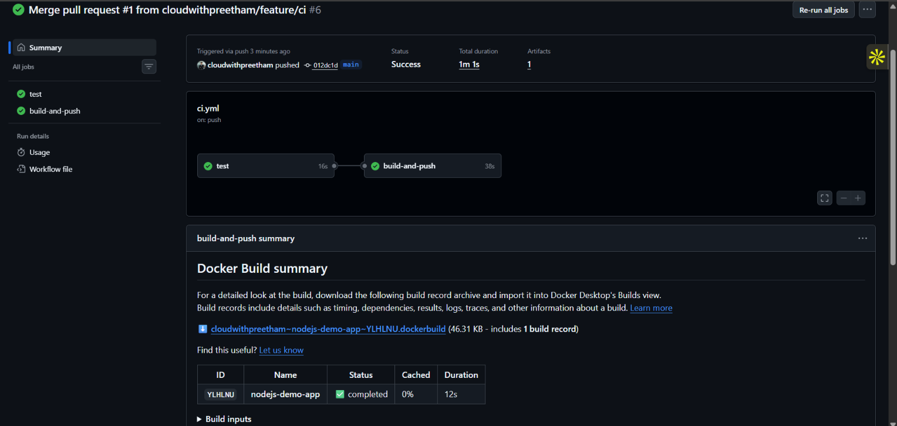
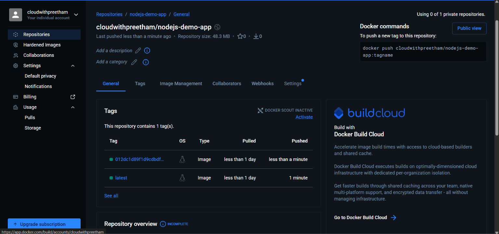

# Automated CI/CD Pipeline for Node.js Application (GitHub Actions & Docker Hub)


An automated Continuous Integration and Continuous Delivery (CI/CD) pipeline for a containerized Node.js REST API built using GitHub Actions and Docker Hub.

---

## 📌 Project Overview

This repository demonstrates an end-to-end automated deployment pipeline:

- **Application:** Lightweight Express.js REST API providing root greeting, health-check probe, and echo endpoints.
- **Testing:** Automated unit testing suite built with `jest` and `supertest`.
- **Containerization:** Production-ready container image built on lightweight `node:20-alpine`.
- **CI/CD Pipeline:** Declarative GitHub Actions workflow automating testing across feature branches and PRs, along with automated multi-tag image building and Docker Hub publishing on merge to `main`.

---

## 🏗️ Architecture & Pipeline Flow

```text
[ Developer Code Push ]
         │
         ├──> [ Feature Branch / Pull Request ] ──> Job: Run Automated Tests (Jest & Supertest)
         │
         └──> [ Merge to main ] ──────────────────> 1. Job: Run Automated Tests
                                                    2. Job: Build Docker Image (Buildx)
                                                    3. Job: Push to Docker Hub (:latest, :<commit-sha>)
```

---

## 📁 Repository Structure

```text
nodejs-demo-app/
├── .github/
│   └── workflows/
│       └── ci.yml               # GitHub Actions CI/CD pipeline definition
├── screenshots/
│   ├── 5-CI-build-successful.png# Proof of passing CI/CD run on GitHub Actions
│   └── 6-dockerhub-push.png     # Proof of published image tags on Docker Hub
├── test/
│   └── app.test.js              # Automated unit and API integration tests
├── .dockerignore                # Build context exclusions
├── .gitignore                  # Git version control exclusions
├── Dockerfile                   # Production Node.js Alpine container recipe
├── package.json                 # Node.js dependencies and run scripts
├── server.js                    # Express application entrypoint
└── README.md                    # Project documentation & interview Q&A
```

---

## 🚀 API Endpoints

| Method | Endpoint    | Description        | Sample Response                                                    |
| :----- | :---------- | :----------------- | :----------------------------------------------------------------- |
| `GET`  | `/`         | Root greeting      | `{"message":"Welcome to the Node.js Demo App!","version":"1.0.0"}` |
| `GET`  | `/health`   | Health-check probe | `{"status":"OK","timestamp":"2026-10-02T..."}`                     |
| `POST` | `/api/echo` | Payload reflection | `{"echo":"Hello Node.js","receivedAt":"2026-10-02T..."}`           |

---

## 🛠️ Local Development & Testing

### 1. Run Directly with Node.js

```bash
# Install dependencies
npm install

# Run automated test suite
npm test

# Start local server
npm start
```

### 2. Run via Docker

```bash
# Build Docker image
docker build -t nodejs-demo-app:local .

# Run container on port 3000
docker run -d -p 3000:3000 --name demo-app-container nodejs-demo-app:local

# Verify health endpoint
curl http://localhost:3000/health

# Clean up container
docker stop demo-app-container && docker rm demo-app-container
```

---

## ⚙️ GitHub Actions Workflow (`.github/workflows/ci.yml`)

The pipeline runs on `ubuntu-latest` runners and consists of two sequential jobs:

1. **`test` Job:**
   - Triggers on pull requests and pushes to `main` and feature branches.
   - Checks out source code via `actions/checkout@v4`.
   - Configures Node.js v20 with npm caching via `actions/setup-node@v4`.
   - Installs clean dependencies via `npm ci`.
   - Executes the test suite via `npm test`.

2. **`build-and-push` Job:**
   - Depends on successful test completion (`needs: test`).
   - Conditioned to run only on commits landing on the primary branch (`if: github.ref == 'refs/heads/main'`).
   - Configures Docker Buildx via `docker/setup-buildx-action@v3`.
   - Authenticates against Docker Hub using GitHub Encrypted Secrets (`DOCKERHUB_USERNAME`, `DOCKERHUB_TOKEN`).
   - Builds the Docker image and publishes it tagged with both `:latest` and the commit SHA (`:${{ github.sha }}`).

---

## 📸 Pipeline & Deployment Proof

### 1. GitHub Actions Pipeline Execution



### 2. Docker Hub Published Images



---

## 📦 Docker Hub Deployment

- **Repository:** `cloudwithpreetham/nodejs-demo-app`
- **Pull Command:**

  ```bash
  docker pull cloudwithpreetham/nodejs-demo-app:latest
  ```

---

## 💡 DevOps Interview Q&A (Task 1)

### 1. What is CI/CD?

- **Continuous Integration (CI):** The software development practice where team members integrate code changes into a shared repository frequently. Automated builds and test runs verify each integration, catching merge bugs and regressions early.
- **Continuous Delivery / Continuous Deployment (CD):** Continuous Delivery automatically packages and tests software artifacts so they are ready for deployment to any environment at any time. Continuous Deployment extends this by automatically deploying passing builds directly into live production environments without manual gates.

### 2. How do GitHub Actions work?

GitHub Actions is an event-driven automation platform built natively into GitHub. It responds to events (such as `push`, `pull_request`, or manual `workflow_dispatch`) by evaluating YAML configuration files in `.github/workflows/`. GitHub provisions runners to execute **jobs**, which execute individual **steps** (commands or reusable actions) in sequence.

### 3. What are runners?

Runners are the computing machines that execute the jobs defined in GitHub Actions workflows:

- **GitHub-hosted runners:** Ephemeral, pre-configured virtual machines (Ubuntu, Windows, macOS) maintained, scaled, and secured by GitHub. Each job receives a fresh VM that is destroyed after completion.
- **Self-hosted runners:** Physical servers, custom virtual machines, or Kubernetes clusters that you manage in your own cloud or on-premises infrastructure, offering custom hardware, persistent storage, and access to private local networks.

### 4. What is the difference between jobs and steps?

- **Jobs:** Major units of work that run on separate runner environments. By default, jobs execute concurrently in parallel unless ordered using the `needs:` keyword.
- **Steps:** Individual, sequential operations executed within a single job on the same runner instance. Steps share the runner filesystem workspace, environment variables, and shell context.

### 5. How do you secure secrets in GitHub Actions?

- Store sensitive values (API tokens, passwords, private keys) in **GitHub Encrypted Secrets** (`Settings` → `Secrets and variables` → `Actions`).
- Reference secrets using `${{ secrets.SECRET_NAME }}` syntax. GitHub automatically redacts these values from workflow run logs using masking (`***`).
- Adhere to the principle of least privilege by using scoped personal access tokens (such as Docker Hub Access Tokens) instead of account passwords.
- Use OpenID Connect (OIDC) when authenticating against major cloud providers (AWS, Azure, GCP) to eliminate static long-lived credentials entirely.

### 6. How do you handle deployment errors?

- **Pipeline Gates:** Use job dependencies (`needs: [test]`) so that failure in unit testing immediately cancels deployment jobs.
- **Error Handlers & Notifications:** Use step status check functions (`if: failure()`) to execute teardown steps and dispatch alert notifications to communication channels (Slack, Discord, PagerDuty).
- **Immutable Tagging & Fast Rollback:** Tag every release with immutable identifiers such as `${{ github.sha }}` in addition to `latest`, allowing instant redeployment of the previous stable tag if a runtime defect arises.
- **Resilient Deployment Strategies:** Employ Blue/Green, Canary, or Rolling deployment patterns with health probes to prevent bad builds from taking down production traffic.

### 7. Explain the Docker build-push workflow

1. **Context Transfer:** The Docker CLI archives the repository files (excluding entries defined in `.dockerignore`) and transmits the context to the Docker build engine.
2. **Layer Execution & Caching:** The engine processes instructions from the `Dockerfile` top-to-bottom, caching intermediate layers to accelerate subsequent rebuilds.
3. **Authentication:** The client authenticates against the container registry (e.g., Docker Hub) via credentials or token (`docker login`).
4. **Tagging:** Identifiers (`:latest`, `:<git-sha>`) are mapped to the generated image ID.
5. **Layer Push:** The engine uploads changed filesystem layer blobs to the remote registry over TLS, skipping layers that already exist on the target registry.

### 8. How can you test a CI/CD pipeline locally?

- **`act` CLI Tool:** A command-line utility that reads GitHub Actions workflows and runs them inside local Docker containers, replicating GitHub-hosted runners (`act push`).
- **Container & Test Simulation:** Run automated unit tests (`npm test`) and execute local container builds (`docker build` and `docker run`) before committing code.
- **Workflow Linters:** Use static validation tools like `actionlint` or VS Code YAML schemas to catch syntax and expression errors prior to pushing.
- **Git Pre-commit Hooks:** Use tools like Husky to automatically run linting and unit tests prior to creating a commit.
